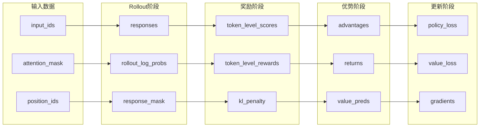
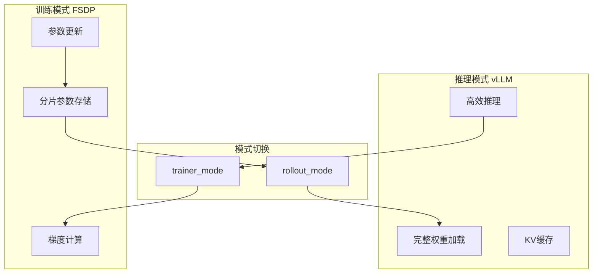
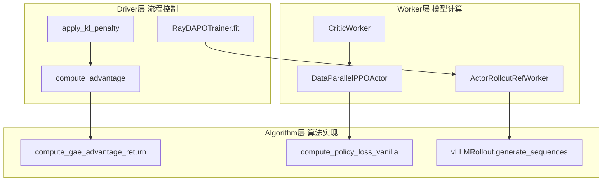
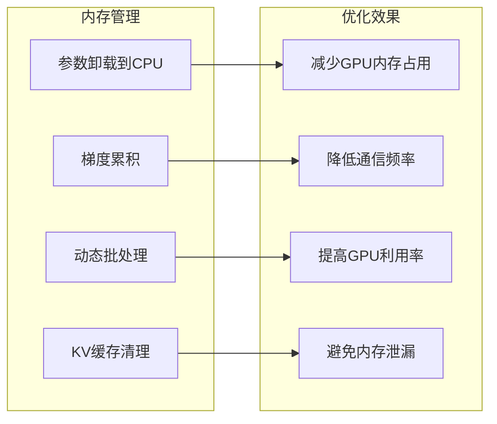
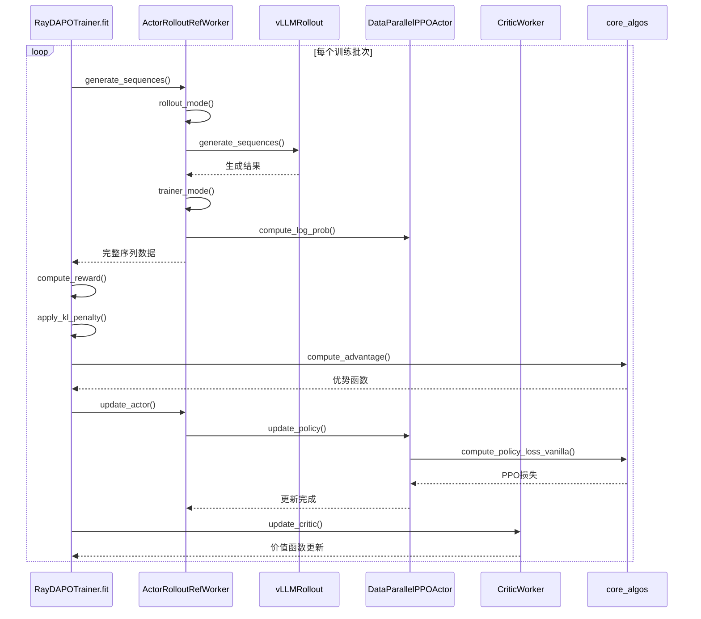
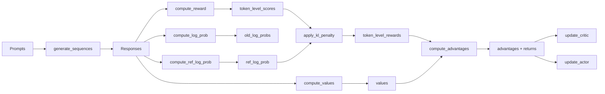

# Megatron训练
基于对 `recipe/dapo/test_dapo_dspk_671b_megatron_96gb.sh`：

## 1）训练代码如何一步步调用到megatron的初始化和并行训练代码
### 入口脚本启动流程：
```javascript
recipe/dapo/test_dapo_dspk_671b_megatron_96gb.sh
└── python3 -m verl.trainer.main_ppo
```

### 主要调用链：
**第一层：训练入口**

+ `verl.trainer.main_ppo:main()`
+ `verl.trainer.main_ppo:run_ppo()`
+ `verl.trainer.main_ppo:TaskRunner.run()`

**第二层：PPO训练器初始化**

+ `verl.trainer.ppo.ray_trainer:RayPPOTrainer.__init__()`
+ `verl.trainer.ppo.ray_trainer:RayPPOTrainer.init_workers()`

**第三层：Worker创建和角色映射**

+ `verl.trainer.main_ppo:TaskRunner.add_actor_rollout_worker()`
    - 根据 `config.actor_rollout_ref.actor.strategy == "megatron"`
    - 导入 `verl.workers.megatron_workers:ActorRolloutRefWorker`

**第四层：Megatron Worker初始化**

+ `verl.workers.megatron_workers:ActorRolloutRefWorker.__init__()`
    - 初始化分布式环境：`torch.distributed.init_process_group()`
    - 初始化Megatron并行状态：`mpu.initialize_model_parallel()`
        * `tensor_model_parallel_size=train_tp=1`
        * `pipeline_model_parallel_size=train_pp=16`
        * `expert_model_parallel_size=train_ep=32`

**第五层：模型构建**

+ `verl.workers.megatron_workers:ActorRolloutRefWorker.init_model()`
+ `verl.workers.megatron_workers:ActorRolloutRefWorker._build_model_optimizer()`
+ `verl.utils.megatron_utils:make_megatron_module()`

**第六层：Megatron核心模型初始化**

+ `verl.models.mcore.registry:init_mcore_model()`
+ `verl.models.mcore.model_initializer:DeepseekV3Model.initialize()`
+ `megatron.core.models.gpt.gpt_model:GPTModel.__init__()`

**第七层：并行训练执行**

+ `verl.trainer.ppo.ray_trainer:RayPPOTrainer.fit()`
+ `verl.workers.megatron_workers:ActorRolloutRefWorker.update_actor()`
+ `verl.workers.actor.megatron_actor:MegatronPPOActor.update_policy()`

## 2）如何一步步调用到megatron的attention module
### Attention模块调用链：
**第一层：模型前向传播**

+ `verl.models.mcore.model_forward:gptmodel_forward()`
+ 调用 `GPTModel.forward()`

**第二层：Transformer层处理**

+ `megatron.core.models.gpt.gpt_model:GPTModel.forward()`
+ 遍历 `self.decoder.layers` (每个Transformer层)

**第三层：单个Transformer层**

+ `megatron.core.transformer.transformer_layer:TransformerLayer.forward()`
+ 调用 `self.self_attention.forward()`

**第四层：Self-Attention核心**

+ `megatron.core.transformer.attention:SelfAttention.forward()`
+ **关键QKV线性变换**：`self.linear_qkv(hidden_states)`
    - 这是attention的核心计算入口

**第五层：QKV并行计算**

+ `megatron.core.transformer.attention:SelfAttention._linear_qkv()`
+ 在tensor parallel模式下，QKV被分割到不同的GPU
+ 每个GPU计算部分的Q、K、V向量

**第六层：Attention核心计算**

+ `megatron.core.transformer.attention:SelfAttention._attn_func()`
+ 计算注意力分数：`attention_scores = torch.matmul(query_layer, key_layer.transpose(-1, -2))`
+ 应用softmax：`attention_probs = torch.nn.functional.softmax(attention_scores, dim=-1)`
+ 计算输出：`context_layer = torch.matmul(attention_probs, value_layer)`

**第七层：输出投影**

+ `megatron.core.transformer.attention:SelfAttention.linear_proj()`
+ 将attention输出投影回hidden_size维度

### 关键配置参数：
+ `tensor_model_parallel_size=1`：张量并行度
+ `pipeline_model_parallel_size=16`：流水线并行度
+ `expert_model_parallel_size=32`：专家并行度（MoE）
+ `num_attention_heads`：注意力头数
+ `num_key_value_heads`：KV头数（用于分组查询注意力）

# FSDP训练
recipe/dapo/run_dapo_qwen2.5_32b_fsdp2.sh

## 1）PyTorch FSDP2 调用链
### 完整API调用序列：
**入口脚本层**：

+ `recipe/dapo/run_dapo_qwen2.5_32b_fsdp2.sh:main()` →
+ `recipe/dapo/main_dapo.py:main()` →
+ `recipe/dapo/main_dapo.py:run_ppo()` →
+ `recipe/dapo/dapo_ray_trainer.py:RayDAPOTrainer.fit()`

**训练层**：

+ `recipe/dapo/dapo_ray_trainer.py:RayDAPOTrainer.fit()` →
+ `recipe/dapo/**dapo_ray_trainer.py**:actor_rollout_wg.**update_actor**(batch)` →
+ `verl/workers/**fsdp_workers.py**:ActorRolloutRefWorker.**update_actor**()` →
+ `verl/workers/**actor/dp_actor.py**:DataParallelPPOActor.**update_policy()**`

**FSDP2核心层**：

+ `verl/workers/fsdp_workers.py:ActorRolloutRefWorker.init_model`
    - `_build_model_optimizer()` 
        * actor_module = actor_module_class.from_pretrained
        * apply_monkey_patch
        * **actor_module_fsdp** = FSDP || **apply_fsdp2(actor_module, fsdp_kwargs, fsdp_config)**
        * `verl/utils/fsdp_utils.py:**<font style="background-color:#FBDE28;">apply_fsdp2</font>**()` →
            + `torch.distributed.fsdp.fully_shard()` (PyTorch原生)
        * **actor_optimizer **= optim.AdamW
        * **actor_lr_scheduler** = get_cosine_schedule_with_warmup
    - self.**actor_module** = self.actor_module_fsdp._fsdp_wrapped_module #fsdp1
    - offload_fsdp_model_to_cpu
    - offload_fsdp_optimizer

**关键函数调用详情**：

1. **模型初始化阶段**：
    - `verl/workers/fsdp_workers.py:ActorRolloutRefWorker.__init__()` →
    - `verl/workers/fsdp_workers.py:create_device_mesh()` →
    - `verl/workers/fsdp_workers.py:_build_model_optimizer()` →
    - `verl/utils/fsdp_utils.py:**<font style="background-color:#FBDE28;">apply_fsdp2</font>**<font style="background-color:#FBDE28;">(model, fsdp_kwargs, config)</font>`

```bash
   modules = []
    for name, module in model.named_modules():
        if module.__class__.__name__ in fsdp_transformer_layer_cls_to_wrap or (
            isinstance(module, nn.Embedding) and not model.config.tie_word_embeddings
        ):
            modules.append(module)

    for idx, module in enumerate(modules):
        # if torch.distributed.is_initialized() and torch.distributed.get_rank() == 0:
        #     print(f"wrap module {module.__class__.__name__}")
        with maybe_patch_fsdp_module(module):
            fully_shard(module, **fsdp_kwargs)

```

2. **FSDP2应用阶段**：
    - `verl/utils/fsdp_utils.py:apply_fsdp2()` 中的关键逻辑：

```python
# 对于Qwen2.5-32B，会包装transformer层和embedding层
for name, module in model.named_modules():
    if module.__class__.__name__ in fsdp_transformer_layer_cls_to_wrap:
        fully_shard(module, **fsdp_kwargs)
fully_shard(model, **fsdp_kwargs)
```

3. **训练更新阶段**：
    - `verl/workers/actor/dp_actor.py:DataParallelPPOActor.update_policy()` →
    - `verl/workers/actor/dp_actor.py:_optimizer_step()` →
    - `verl/utils/fsdp_utils.py:fsdp2_clip_grad_norm_()`

## 2）从DataParallelPPOActor.update_policy()到PyTorch FSDP2的完整调用链
### Forward计算路径：
**训练入口**：

+ `verl/workers/actor/**dp_actor.py**:DataParallelPPOActor.update_policy()` →
+ `verl/workers/actor/**dp_actor.py**:DataParallelPPOActor._forward_micro_batch()` →
+ `verl/workers/actor/**dp_actor.py**:self.actor_module(input_ids=..., attention_mask=..., position_ids=...)`

**FSDP2 Forward调用**：

+ `verl/workers/actor/dp_actor.py:self.actor_module()` (这是一个被FSDP2包装的模型) →
+ `torch.distributed.**fsdp.FSDPModule.__call__()**` (PyTorch FSDP2的forward入口) →
+ `torch.distributed.fsdp._runtime_utils._exec_forward()` →
+ `torch.distributed.fsdp._runtime_utils._pre_forward()` (参数reshard) →
+ `原始模型的forward()` (Qwen2.5模型的forward) →
+ `torch.distributed.fsdp._runtime_utils._post_forward()` (参数offload)

**Qwen2.5 LLM的Attention调用**：

+ `transformers.models.qwen2.modeling_qwen2.**Qwen2Attention.forward**()` →
+ `verl/models/transformers/monkey_patch.py:_ulysses_flash_attention_forward()` (如果启用Ulysses) →
+ `transformers.modeling_flash_attention_utils._flash_attention_forward()` →
+ `flash_attn.**flash_attn_func()**`** (底层Flash Attention)**

### Backward计算路径：
**Backward触发**：

+ `verl/workers/actor/dp_actor.py:DataParallelPPOActor._forward_micro_batch()` 返回log_probs →
+ `verl/workers/actor/dp_actor.py:DataParallelPPOActor.update_policy()` 中计算loss →
+ `loss.backward()` (PyTorch自动求导)

**FSDP2 Backward调用**：

+ `torch.autograd.backward()` (PyTorch自动求导入口) →
+ `torch.distributed.fsdp.FSDPModule.backward()` (FSDP2拦截backward) →
+ `torch.distributed.fsdp._runtime_utils._exec_backward()` →
+ `torch.distributed.fsdp._runtime_utils._backward_pre_forward_hook()` (梯度聚合) →
+ `torch.distributed.fsdp._runtime_utils._reduce_grads()` (跨节点梯度reduce) →
+ `torch.distributed.fsdp._runtime_utils._backward_post_forward_hook()` (梯度处理)

### Optimizer更新路径：
**Optimizer Step**：

+ `verl/workers/actor/dp_actor.py:DataParallelPPOActor._optimizer_step()` →
+ `verl/utils/fsdp_utils.py:fsdp2_clip_grad_norm_()` (FSDP2梯度裁剪) →
+ `self.actor_optimizer.step()` (FSDP2包装的optimizer) →
+ `torch.distributed.fsdp.FSDPOptimizer.step()` →
+ `torch.distributed.fsdp._runtime_utils._exec_optimizer_step()` →
+ `torch.distributed.fsdp._runtime_utils._pre_optimizer_step()` (参数reshard) →
+ `原始optimizer.step()` →
+ `torch.distributed.fsdp._runtime_utils._post_optimizer_step()` (参数offload)

## 3）PyTorch Attention Module 调用链 (Qwen2.5 LLM)
### 完整API调用序列：
**Attention模块初始化**：

+ `verl/workers/fsdp_workers.py:ActorRolloutRefWorker._build_model_optimizer()` →
+ `verl/models/transformers/monkey_patch.py:apply_monkey_patch()` →
+ `verl/models/transformers/monkey_patch.py:_ulysses_flash_attention_forward()`

**具体调用路径**：

1. **Monkey Patch阶段**：
    - `verl/models/transformers/monkey_patch.py:apply_monkey_patch()` →
    - 对于Qwen2.5-32B LLM模型，会patch `transformers.models.qwen2.modeling_qwen2.Qwen2Attention.forward` →
    - 替换为 `verl/models/transformers/monkey_patch.py:_ulysses_flash_attention_forward()`
2. **Forward执行阶段**：
    - `verl/workers/actor/dp_actor.py:DataParallelPPOActor._forward_micro_batch()` →
    - `verl/workers/actor/dp_actor.py:self.actor_module()` →
    - `transformers.models.qwen2.modeling_qwen2.Qwen2ForCausalLM.forward()` →
    - `transformers.models.qwen2.modeling_qwen2.Qwen2Model.forward()` →
    - `transformers.models.qwen2.modeling_qwen2.Qwen2DecoderLayer.forward()` →
    - `verl/models/transformers/monkey_patch.py:_ulysses_flash_attention_forward()` →
    - `transformers.modeling_flash_attention_utils._flash_attention_forward()` →
    - `flash_attn.flash_attn_func()`
3. **Flash Attention调用**：
    - `verl/models/transformers/monkey_patch.py:_ulysses_flash_attention_forward()` →
    - `transformers.modeling_flash_attention_utils._flash_attention_forward()` →
    - `flash_attn.flash_attn_func()` (底层Flash Attention)

**关键Attention函数详情**：

1. **Ulysses序列并行支持**：
    - `verl/models/transformers/monkey_patch.py:_ulysses_flash_attention_forward()` →
    - `verl/utils/ulysses:gather_seq_scatter_heads()` →
    - `verl/utils/ulysses:gather_heads_scatter_seq()`
2. **Qwen2.5 LLM的Attention实现**：
    - `transformers.models.qwen2.modeling_qwen2.Qwen2Attention.forward()` (被patch) →
    - `verl/models/transformers/monkey_patch.py:_ulysses_flash_attention_forward()` (patch后的版本)
3. **底层Flash Attention**：
    - `transformers.modeling_flash_attention_utils._flash_attention_forward()` →
    - `flash_attn.flash_attn_func()` →
    - `flash_attn.flash_attn_varlen_func()` (如果使用remove_padding)

## 总结
这个调用链展示了从脚本入口到底层PyTorch FSDP2和Flash Attention的完整路径：

1. **FSDP2路径**：脚本 → Ray Trainer → FSDP Worker → apply_fsdp2 → PyTorch fully_shard → FSDPModule.forward/backward
2. **Attention路径**：脚本 → Monkey Patch → Qwen2Attention → _ulysses_flash_attention_forward → Flash Attention


# vllm推理
#### 入口脚本层
+ `recipe/dapo/run_dapo_qwen2.5_32b_tis.sh` → 调用 `python3 -m recipe.dapo.main_dapo`

#### 主程序层
+ `recipe/dapo/main_dapo.py` → `main()` → `run_ppo()` → `TaskRunner.run()`
    - 创建 `RayDAPOTrainer` 实例
    - 调用 `trainer.init_workers()` 和 `trainer.fit()`

#### 训练器层
+ `recipe/dapo/dapo_ray_trainer.py` → `RayDAPOTrainer.fit()`
    - 继承自 `RayPPOTrainer.fit()`
    - 调用 `self.actor_rollout_wg.generate_sequences(gen_batch)`

#### 基础训练器层
+ `verl/trainer/ppo/ray_trainer.py` → `RayPPOTrainer.init_workers()`
    - 创建 `ActorRolloutRefWorker` 实例
    - 调用 `self.actor_rollout_wg.init_model()`

#### Worker层
+ `verl/workers/fsdp_workers.py` → `ActorRolloutRefWorker.init_model()`
    - 调用 `self._build_rollout()`
    - 创建 rollout 实例：`self.rollout = get_rollout_class(rollout_config.name, rollout_config.mode)`

#### Rollout工厂层
+ `verl/workers/rollout/base.py` → `get_rollout_class("vllm", "sync")`
    - 返回 `verl.workers.rollout.vllm_rollout.vLLMRollout`

#### vLLM Rollout层
+ `verl/workers/rollout/vllm_rollout/vllm_rollout_spmd.py` → `vLLMRollout.__init__()`
    - 初始化 vLLM 引擎：`self.inference_engine = LLM(...)`
    - 调用 `self.inference_engine.generate()` 进行推理

## 2）如何一步步调用到vllm的attention module？
### vLLM Attention Module调用序列：
#### vLLM引擎初始化
+ `vLLMRollout.__init__()` → `LLM(model=model_path, ...)`
    - 创建 vLLM 推理引擎
    - 配置 tensor_parallel_size、dtype 等参数

#### 模型加载和权重更新
+ `vLLMRollout.update_weights()` → `model.load_weights(weights)`
    - 获取模型：`self.inference_engine.llm_engine.model_executor.driver_worker.worker.model_runner.model`
    - 调用 vLLM 内部的权重加载机制

#### 推理执行
+ `vLLMRollout.generate_sequences()` → `self.inference_engine.generate(prompts=vllm_inputs, ...)`
    - vLLM 引擎内部的推理流程
    - **关键调用路径**：
        * `LLM.generate()` → `llm_engine.generate()`
        * `llm_engine.generate()` → `model_executor.execute_model()`
        * `model_executor.execute_model()` → `worker.model_runner.execute_model()`
        * `model_runner.execute_model()` → `model.forward()`

#### Attention Module调用
+ **模型前向传播** → `model.forward()` → **各个Transformer层的forward**
    - `Qwen2ForCausalLM.forward()` → `model(input_ids, ...)`
    - `Qwen2Model.forward()` → 遍历各个layer
    - `Qwen2DecoderLayer.forward()` → `self_attn.forward()`
    - `Qwen2Attention.forward()` → **核心attention计算**
        * 调用 flash_attention_2 实现
        * 执行 QKV projection、attention score计算、softmax、value aggregation等

#### 关键的Attention相关函数：
+ `Qwen2Attention.forward()` - 主要attention逻辑
+ `flash_attn_func()` - Flash Attention实现（通过attn_implementation="flash_attention_2"配置）
+ `apply_rotary_pos_emb()` - 旋转位置编码
+ `repeat_kv()` - KV head扩展（用于GQA/MQA）

### 配置关键点：
从脚本中可以看到关键配置：

```bash
actor_rollout_ref.rollout.name=vllm
actor_rollout_ref.rollout.tensor_model_parallel_size=${gen_tp}  # 4
actor_rollout_ref.rollout.enable_chunked_prefill=True
```

这确保了使用vLLM作为推理后端，并启用了tensor parallel和chunked prefill优化。

整个调用链路从shell脚本开始，经过多层抽象，最终调用到vLLM引擎内部的attention模块进行高效的推理计算


# SGLang推理
## 1）代码如何一步步调用到sglang相关初始化和推理的API调用序列
### 入口脚本层
+ `recipe/dapo/run_dapo_qwen2.5_32b_tis.sh` → 调用主训练脚本
    - 设置 `actor_rollout_ref.rollout.name=sglang`

### 主训练入口层
+ `recipe/dapo/main_dapo.py:main()` → 主函数入口
+ `recipe/dapo/main_dapo.py:run_ppo()` → 运行PPO训练
+ `recipe/dapo/main_dapo.py:TaskRunner.run()` → 任务运行器
+ `recipe/dapo/main_dapo.py:RayDAPOTrainer()` → 创建DAPO训练器

### 训练器层
+ `recipe/dapo/dapo_ray_trainer.py:RayDAPOTrainer.fit()` → 训练循环
+ `recipe/dapo/dapo_ray_trainer.py:RayDAPOTrainer._validate()` → 验证阶段
+ `recipe/dapo/dapo_ray_trainer.py:RayDAPOTrainer.generate_sequences()` → 生成序列调用

### Worker层
+ `verl/workers/fsdp_workers.py:ActorRolloutRefWorker.generate_sequences()` → 生成序列
+ `verl/workers/fsdp_workers.py:ActorRolloutRefWorker._build_rollout()` → 构建rollout

### Rollout工厂层
+ `verl/workers/rollout/base.py:get_rollout_class()` → 获取rollout类
    - 根据 `("sglang", "sync")` 返回 `SGLangRollout`

### SGLang Rollout层
+ `verl/workers/rollout/sglang_rollout/sglang_rollout.py:SGLangRollout.__init__()` → 初始化
    - `_init_distributed_env()` → 初始化分布式环境
    - `_verify_config()` → 验证配置
    - `_init_inference_engine()` → 初始化推理引擎
    - `_init_sampling_params()` → 初始化采样参数

### SGLang引擎层
+ `verl/workers/rollout/sglang_rollout/sglang_rollout.py:AsyncEngine.__init__()` → 异步引擎初始化
+ `verl/workers/rollout/sglang_rollout/sglang_rollout.py:SGLangRollout.generate_sequences()` → 生成序列
    - `_batch_level_generate_sequences()` → 批量级别生成
    - `_req_level_generate_sequences()` → 请求级别生成

### 推理执行层
+ `verl/workers/rollout/sglang_rollout/sglang_rollout.py:AsyncEngine.async_generate()` → 异步生成
+ `verl/workers/rollout/sglang_rollout/http_server_engine.py:AsyncHttpServerAdapter.generate()` → HTTP适配器生成

## 2）代码如何一步步调用到sglang的attention module的API调用序列
### Attention Backend配置层
+ `verl/workers/rollout/sglang_rollout/sglang_rollout.py:SGLangRollout._init_inference_engine()` → 初始化推理引擎
    - 设置 `attention_backend = "fa3"` (默认) 或从配置获取
    - 传递给SGLang引擎参数：

```python
"mm_attention_backend": backend,
"attention_backend": backend,
```

### SGLang内部Attention调用链
+ `sglang.srt.entrypoints.engine.Engine` → SGLang引擎入口
+ `sglang.srt.managers.tokenizer_manager.TokenizerManager` → Tokenizer管理器
+ `sglang.srt.managers.model_runner.ModelRunner` → 模型运行器
+ `sglang.srt.layers.attention` → Attention层实现
    - **FlashInfer Attention Backend** (`flashinfer`)
    - **FA3 Attention Backend** (`fa3`) - 默认选择

### Attention Module具体调用路径
1. **模型前向传播**：
    - `ModelRunner.forward()` → 调用模型前向传播
    - `TransformerBlock.forward()` → Transformer块前向传播
    - `Attention.forward()` → Attention层前向传播
2. **Attention Backend选择**：
    - 根据 `attention_backend` 参数选择具体实现
    - 默认使用 `fa3` (FlashAttention-3) 后端
    - 可配置为 `flashinfer` 后端
3. **Attention计算**：
    - **FA3 Backend**: `sglang.srt.layers.fa3_attention.Fa3Attention`
    - **FlashInfer Backend**: `sglang.srt.layers.flashinfer_attention.FlashInferAttention`

### 权重同步中的Attention相关调用
+ `verl/workers/rollout/sglang_rollout/sglang_rollout.py:SGLangRollout.update_weights()` → 更新权重
+ `sglang.srt.weight_sync.utils.update_weights()` → SGLang权重同步工具
+ **Attention层权重更新** → 更新Query、Key、Value、Output投影矩阵

### 分布式并行中的Attention
+ `verl/third_party/sglang/parallel_state.py` → 并行状态管理
+ `get_tensor_model_parallel_group()` → 获取张量并行组
+ **Attention张量并行** → Attention计算在TP组间并行执行

## 关键配置参数
+ `attention_backend`: "fa3" (默认) 或 "flashinfer"
+ `tensor_model_parallel_size`: 张量并行大小
+ `mm_attention_backend`: 多模态attention后端
+ `gpu_memory_utilization`: GPU内存利用率

## 完整训练流程的函数调用链
## 核心函数功能映射表
| 函数名 | 文件位置 | 关键输入 | 关键输出 |
| --- | --- | --- | --- |
| `RayDAPOTrainer.fit` | `recipe/dapo/dapo_ray_trainer.py:85` | 数据加载器 | 训练好的模型 |
| `ActorRolloutRefWorker.generate_sequences` | `verl/workers/fsdp_workers.py:1089` | prompts | 生成序列 |
| `ActorRolloutRefWorker.rollout_mode` | `verl/workers/fsdp_workers.py:650` | - | vLLM就绪状态 |
| `vLLMRollout.generate_sequences` | `verl/workers/rollout/vllm_rollout/vllm_rollout_spmd.py:200` | prompts | 批量生成结果 |
| `DataParallelPPOActor.compute_log_prob` | `verl/workers/actor/dp_actor.py:150` | 序列数据 | 对数概率 |
| `compute_advantage` | `verl/trainer/ppo/ray_trainer.py:280` | 奖励数据 | 优势函数 |
| `apply_kl_penalty` | `verl/trainer/ppo/ray_trainer.py:120` | 策略概率 | 惩罚后奖励 |
| `compute_gae_advantage_return` | `verl/trainer/ppo/core_algos.py:200` | 奖励+价值 | GAE优势 |
| `compute_grpo_outcome_advantage` | `verl/trainer/ppo/core_algos.py:250` | outcome奖励 | 相对优势 |
| `DataParallelPPOActor.update_policy` | `verl/workers/actor/dp_actor.py:250` | 优势数据 | 更新后的策略 |
| `compute_policy_loss_vanilla` | `verl/trainer/ppo/core_algos.py:600` | 概率+优势 | PPO损失 |
| `CriticWorker.update_critic` | `verl/workers/fsdp_workers.py:1450` | 回报数据 | 更新后的价值函数 |


## 数据流转换图


## 关键设计模式图解
### 1. 混合引擎模式


### 2. 分层计算架构


### 3. 内存优化策略


## 函数调用时序图

## 主要组件说明

- **RayDAPOTrainer**: 训练协调器，运行在driver进程
- **ActorRolloutWorkerGroup**: Actor模型和Rollout引擎的工作组（Megatron训练 + vLLM推理）
- **CriticWorkerGroup**: Critic模型的工作组（Megatron训练）
- **RefPolicyWorkerGroup**: 参考策略模型的工作组（可选）
- **RewardModelWorkerGroup**: 奖励模型的工作组（可选）
- **reward_fn**: 奖励函数（规则或模型）

## 完整训练流程时序图

```mermaid
sequenceDiagram
    participant Driver as RayDAPOTrainer<br/>(Driver进程)
    participant ActorRollout as ActorRolloutWorkerGroup<br/>(Megatron+vLLM)
    participant Critic as CriticWorkerGroup<br/>(Megatron)
    participant RefPolicy as RefPolicyWorkerGroup<br/>(可选)
    participant RM as RewardModelWorkerGroup<br/>(可选)
    participant RewardFn as reward_fn<br/>(规则/函数)

    Note over Driver: fit() 入口
    
    rect rgb(240, 240, 255)
        Note over Driver: 初始化阶段
        Driver->>Driver: _load_checkpoint()
        Driver->>Driver: _validate() (可选)
    end

    loop 每个训练步骤 (global_steps)
        rect rgb(255, 240, 240)
            Note over Driver,ActorRollout: 1. 生成序列阶段 (generate_sequences)
            Driver->>Driver: 准备gen_batch (pop input_ids等)
            Driver->>Driver: gen_batch.repeat(n次采样)
            Driver->>ActorRollout: generate_sequences(gen_batch)
            Note over ActorRollout: vLLM推理引擎生成响应
            ActorRollout-->>Driver: gen_batch_output (responses)
            Driver->>Driver: batch.union(gen_batch_output)
        end

        rect rgb(255, 255, 240)
            Note over Driver,RewardFn: 2. 计算奖励阶段 (compute_reward)
            
            opt 如果使用奖励模型
                Driver->>RM: compute_rm_score(batch)
                RM-->>Driver: rm_scores
                Driver->>Driver: batch.union(rm_scores)
            end
            
            Driver->>RewardFn: reward_fn(batch)
            Note over RewardFn: 计算token级别的奖励分数
            RewardFn-->>Driver: token_level_scores
            Driver->>Driver: batch["token_level_scores"] = scores
        end

        rect rgb(240, 255, 240)
            Note over Driver,ActorRollout: 3. 计算对数概率阶段 (compute_log_prob)
            Driver->>ActorRollout: compute_log_prob(batch)
            Note over ActorRollout: Megatron前向传播计算log_probs
            ActorRollout-->>Driver: old_log_probs + entropys
            Driver->>Driver: batch.union(old_log_prob)
            Driver->>Driver: 计算entropy指标
        end

        opt 如果使用参考策略
            rect rgb(240, 255, 255)
                Note over Driver,RefPolicy: 4. 计算参考策略对数概率
                Driver->>RefPolicy: compute_ref_log_prob(batch)
                RefPolicy-->>Driver: ref_log_prob
                Driver->>Driver: batch.union(ref_log_prob)
            end
        end

        opt 如果使用Critic
            rect rgb(255, 240, 255)
                Note over Driver,Critic: 5. 计算价值函数 (compute_values)
                Driver->>Critic: compute_values(batch)
                Note over Critic: Megatron前向传播计算values
                Critic-->>Driver: values
                Driver->>Driver: batch.union(values)
            end
        end

        rect rgb(255, 245, 230)
            Note over Driver: 6. 应用KL惩罚 (apply_kl_penalty)
            opt 如果use_kl_in_reward=True
                Driver->>Driver: apply_kl_penalty(batch, kl_ctrl)
                Note over Driver: kld = kl_penalty(old_log_probs, ref_log_prob)<br/>token_level_rewards = scores - beta * kld<br/>更新KL控制器
                Driver->>Driver: batch["token_level_rewards"] = rewards
            end
        end

        rect rgb(230, 245, 255)
            Note over Driver: 7. 计算优势函数 (compute_advantages)
            Driver->>Driver: compute_response_mask(batch)
            Driver->>Driver: compute_advantage(batch, adv_estimator)
            Note over Driver: 根据算法类型计算优势:<br/>- GAE: compute_gae_advantage_return()<br/>- GRPO: compute_grpo_outcome_advantage()<br/>- REMAX/REINFORCE++等其他估计器
            Driver->>Driver: batch["advantages"] = advantages<br/>batch["returns"] = returns
        end

        opt 如果使用Critic
            rect rgb(255, 230, 245)
                Note over Driver,Critic: 8. 更新Critic (update_critic)
                Driver->>Critic: update_critic(batch)
                Note over Critic: Megatron训练:<br/>1. 前向传播计算values<br/>2. 计算value loss<br/>3. 反向传播<br/>4. 优化器更新
                Critic-->>Driver: critic_output (metrics)
                Driver->>Driver: 收集critic指标
            end
        end

        rect rgb(245, 230, 255)
            Note over Driver,ActorRollout: 9. 更新Actor (update_actor)
            opt 如果global_steps > critic_warmup
                Driver->>ActorRollout: update_actor(batch)
                Note over ActorRollout: Megatron训练:<br/>1. 前向传播计算log_probs<br/>2. 计算policy loss (PPO clip)<br/>3. 反向传播<br/>4. 优化器更新
                ActorRollout-->>Driver: actor_output (metrics)
                Driver->>Driver: 收集actor指标
            end
        end

        rect rgb(230, 255, 230)
            Note over Driver: 10. 验证和保存
            opt 如果到达test_freq
                Driver->>Driver: _validate()
            end
            
            opt 如果到达save_freq
                Driver->>Driver: _save_checkpoint()
            end
        end

        Driver->>Driver: 收集和记录所有指标
        Driver->>Driver: global_steps += 1
    end

    Note over Driver: 训练完成
```



## 关键步骤详解

### 1. generate_sequences() - 序列生成
- **位置**: [`RayDAPOTrainer.fit()`](recipe/dapo/dapo_ray_trainer.py:87) → [`actor_rollout_wg.generate_sequences()`](verl/workers/fsdp_workers.py:200)
- **功能**: 使用vLLM推理引擎生成响应序列
- **输入**: gen_batch (prompts, attention_mask等)
- **输出**: responses, rollout_log_probs等

### 2. compute_reward() - 奖励计算
- **位置**: [`RayDAPOTrainer.fit()`](recipe/dapo/dapo_ray_trainer.py:127)
- **功能**: 
  - 可选：调用奖励模型计算分数
  - 调用reward_fn结合规则和模型分数
- **输出**: token_level_scores

### 3. compute_log_prob() - 对数概率计算
- **位置**: [`RayDAPOTrainer.fit()`](recipe/dapo/dapo_ray_trainer.py:145) → [`actor_rollout_wg.compute_log_prob()`](verl/workers/fsdp_workers.py:220)
- **功能**: 使用Megatron训练引擎重新计算当前策略的log_probs
- **输出**: old_log_probs, entropys

### 4. compute_ref_log_prob() - 参考策略对数概率
- **位置**: [`RayDAPOTrainer.fit()`](recipe/dapo/dapo_ray_trainer.py:157) → [`ref_policy_wg.compute_ref_log_prob()`](verl/workers/fsdp_workers.py:235)
- **功能**: 计算参考策略（冻结模型）的log_probs
- **输出**: ref_log_prob

### 5. compute_values() - 价值函数计算
- **位置**: [`RayDAPOTrainer.fit()`](recipe/dapo/dapo_ray_trainer.py:164) → [`critic_wg.compute_values()`](verl/workers/fsdp_workers.py:250)
- **功能**: 使用Critic模型计算状态价值
- **输出**: values

### 6. apply_kl_penalty() - KL惩罚应用
- **位置**: [`RayDAPOTrainer.fit()`](recipe/dapo/dapo_ray_trainer.py:169) → [`apply_kl_penalty()`](verl/trainer/ppo/ray_trainer.py:127)
- **功能**: 
  - 计算当前策略和参考策略之间的KL散度
  - 应用KL惩罚到奖励: `token_level_rewards = scores - beta * kld`
  - 更新自适应KL控制器
- **输出**: token_level_rewards, KL指标

### 7. compute_advantages() - 优势函数计算
- **位置**: [`RayDAPOTrainer.fit()`](recipe/dapo/dapo_ray_trainer.py:177) → [`compute_advantage()`](verl/trainer/ppo/ray_trainer.py:189)
- **功能**: 根据不同的优势估计器计算优势
  - **GAE**: 广义优势估计 [`compute_gae_advantage_return()`](verl/trainer/ppo/core_algos.py)
  - **GRPO**: 组相对策略优化 [`compute_grpo_outcome_advantage()`](verl/trainer/ppo/core_algos.py)
  - **REMAX**: 最大化奖励优势估计
  - **REINFORCE++**: 增强版REINFORCE
- **输出**: advantages, returns

### 8. update_critic() - Critic更新
- **位置**: [`RayDAPOTrainer.fit()`](recipe/dapo/dapo_ray_trainer.py:186) → [`critic_wg.update_critic()`](verl/workers/fsdp_workers.py:260)
- **功能**: 
  - 使用Megatron训练引擎更新Critic
  - 计算value loss: `(values - returns)^2`
  - 反向传播和优化器更新
- **输出**: critic训练指标

### 9. update_actor() - Actor更新
- **位置**: [`RayDAPOTrainer.fit()`](recipe/dapo/dapo_ray_trainer.py:194) → [`actor_rollout_wg.update_actor()`](verl/workers/fsdp_workers.py:200)
- **功能**: 
  - 使用Megatron训练引擎更新Actor
  - 计算PPO clip loss
  - 反向传播和优化器更新
- **输出**: actor训练指标

## 数据流转



## 关键配置参数

- `actor_rollout_ref.rollout.n`: 每个prompt的采样次数
- `algorithm.adv_estimator`: 优势估计器类型 (GAE/GRPO/REMAX等)
- `algorithm.use_kl_in_reward`: 是否在奖励中使用KL惩罚
- `algorithm.gamma`: 折扣因子
- `algorithm.lam`: GAE的lambda参数
- `trainer.critic_warmup`: Critic预热步数

## 性能优化

1. **混合引擎**: Megatron用于训练（支持大规模并行），vLLM用于推理（高吞吐量）
2. **批处理**: 所有操作都是批量处理
3. **分布式**: 使用Ray进行分布式协调
4. **异步计算**: 部分操作可以异步执行（如reward_fn）
5. **内存优化**: 支持gradient checkpointing、offload等技术

## 参考文件

- 主训练器: [`recipe/dapo/dapo_ray_trainer.py`](recipe/dapo/dapo_ray_trainer.py)
- 基类训练器: [`verl/trainer/ppo/ray_trainer.py`](verl/trainer/ppo/ray_trainer.py)
- FSDP Workers: [`verl/workers/fsdp_workers.py`](verl/workers/fsdp_workers.py)
- Megatron Workers: [`verl/workers/megatron_workers.py`](verl/workers/megatron_workers.py)
- 核心算法: [`verl/trainer/ppo/core_algos.py`](verl/trainer/ppo/core_algos.py)
